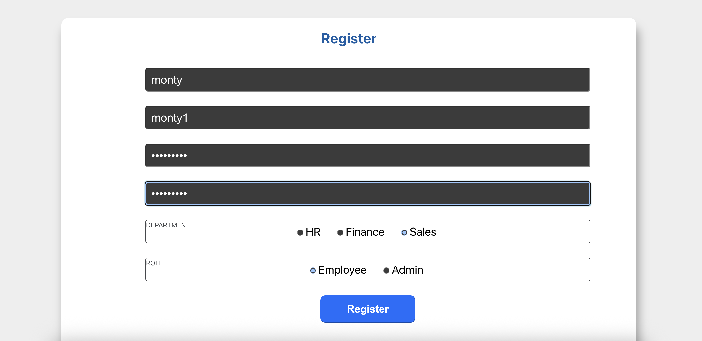
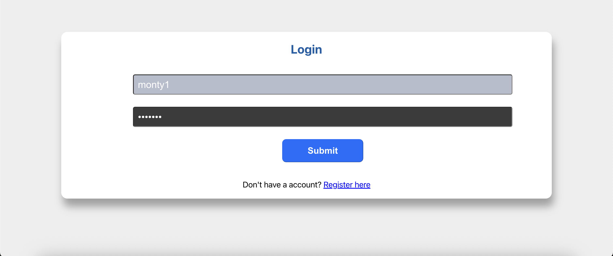
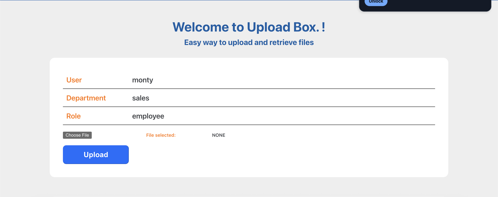
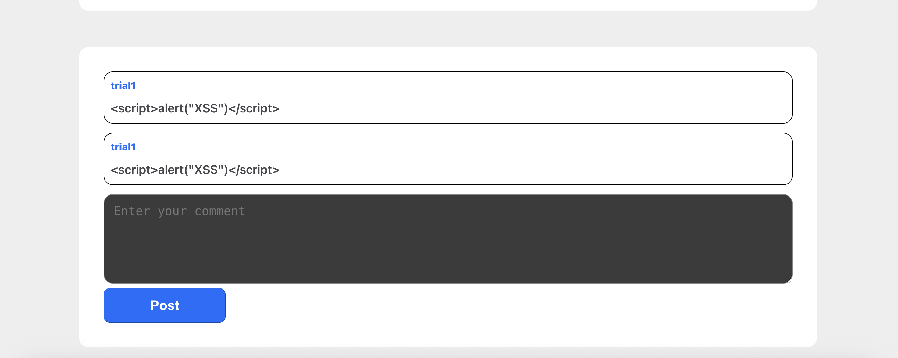
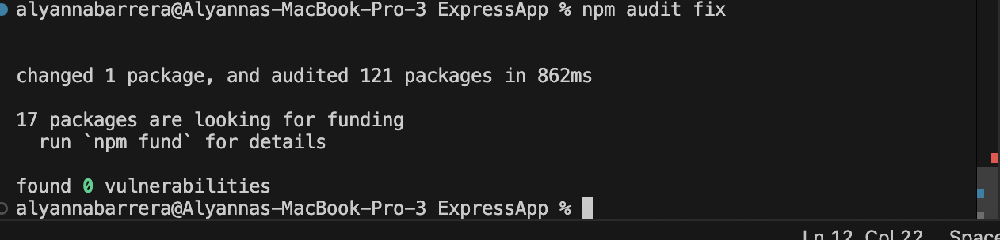
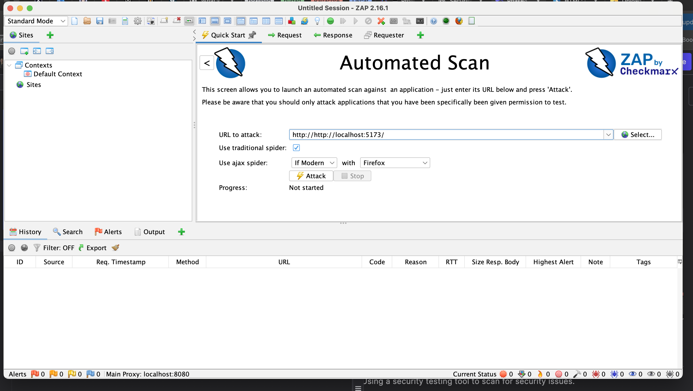
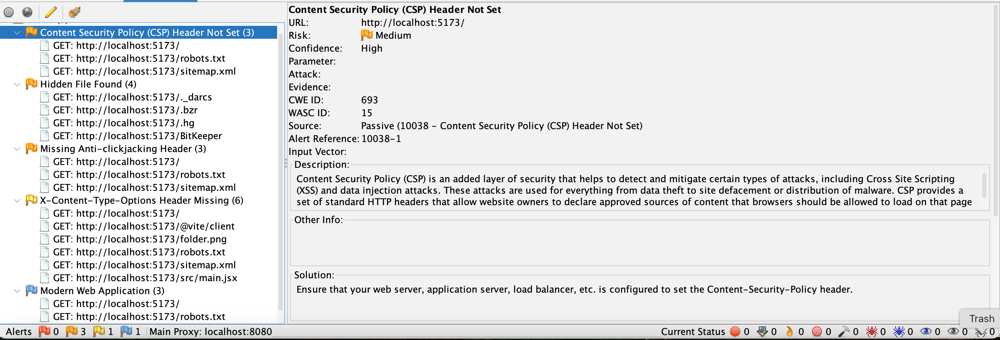
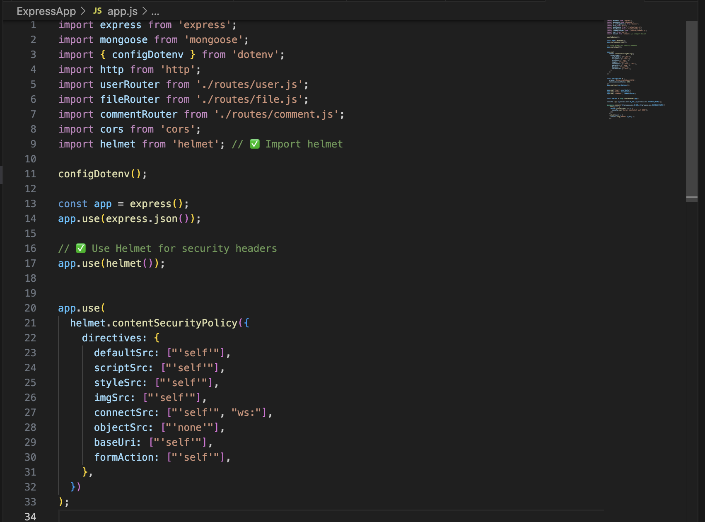
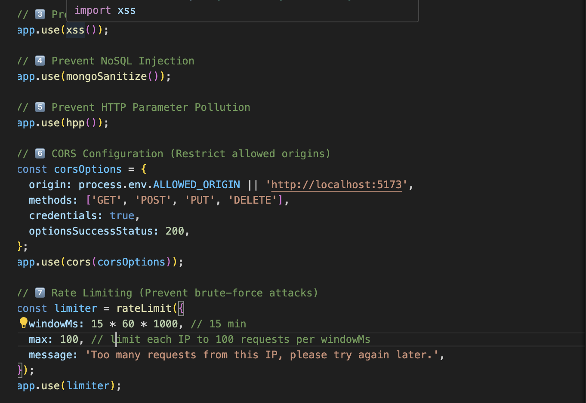

# Phase 4 - Security Testing and Ethical and Legal Considerations

## 1. Manual Testing

Let's create an account: 


### A. SQL Injection
> Since the project uses backend through MongoDB we can try an SQL injectiong through any query field that is sent to the backend.
> Let's use the "password field"

How to test:
- In a text input for password, type:
```
' OR '1'='1
```



- If we submit the form, we can see that the authentication suceeds even with the wrong password.


- authentication successful

---

### B. Cross-Site Scripting (XSS)
> This tests whether user input is rendered unsanitized.

Where to test:
- Comments section
- Any text-based profile or form field that’s shown later.


*this is the form area where we would test XSS*


How to test:
- [ ] In the comment area, type:
```
<script>alert("XSS")</script>
```

- If we submit the form, we do not see any alert box which means it is being rendered in the browser as plain text, not as an executable script.

## 2. NPM Audit
- Ensure all dependencies are secure by running npm audit in your project directory to check for known vulnerabilities.


Recommended fix:
- Run:
```
npm audit fix
```


*fixed*

## 3. OWASP ZAP
Using a security testing tool to scan for security issues.


*Run automated scan, input the localhost url*


*These are all the security issues found*

### ZAP Findings explanation:

1. **Content Security Policy (CSP) Header Not Set**
    - The server is not sending a CSP header, which tells the browser which sources of scripts, images, and styles are allowed.
    - Without it, attackers have more opportunities to inject malicious code (XSS attacks).

TO FIX:
- Set a CSP header like:
```
Content-Security-Policy: default-src 'self';
```

2. **Hidden File Found**
    - ZAP found files or directories that are normally hidden (e.g., .git, .bzr, .hg, .darcs, BitKeeper).

TO FIX:

> Remove these files from the production server or block them in web server configuration.

3. **Missing Anti-clickjacking Header**
    - The HTTP response is missing the X-Frame-Options or Content-Security-Policy frame-ancestors header.

> Example risk:
> An attacker could trick users into clicking hidden buttons on your site.

TO FIX:
Add
```
X-Frame-Options: DENY
```

4. **X-Content-Type-Options Header Missing**
    - The HTTP response doesn’t have X-Content-Type-Options: nosniff.
    - This header prevents browsers from guessing (“sniffing”) file types, which can lead to malicious files executing.

> Example risk:
> If an attacker uploads a file disguised as an image, the browser might treat it as JavaScript and run it.

To fix:
Add
```
X-Content-Type-Options: nosniff
```

5. **Modern Web Application**
    - ZAP detected that our site is using a modern JavaScript framework (React/Vite in your case).
    - This is informational, not a vulnerability, but it tells an attacker what tech stack we use.

To Fix:
> Keep dependencies updated.
    
## ZAP Vulnerability Report

| #  | Type of Vulnerability                              | Affected Area / Feature                  | Severity Level | Recommended Fix |
|----|---------------------------------------------------|-------------------------------------------|----------------|-----------------|
| 1  | Missing Security Header – `X-Content-Type-Options` | Entire application HTTP responses         | Medium         | Add `X-Content-Type-Options: nosniff` header in server configuration to prevent MIME-type sniffing. |
| 2  | Missing Security Header – `X-Frame-Options`        | Entire application HTTP responses         | Medium         | Add `X-Frame-Options: DENY` (or `SAMEORIGIN` if framing is needed) to prevent clickjacking. |
| 3  | Missing Security Header – `Content-Security-Policy`| Entire application HTTP responses         | High           | Define a `Content-Security-Policy` header to restrict the sources of scripts, styles, and other resources. |
| 4  | Insecure Cookie – Missing `HttpOnly` and/or `Secure` flags | Session cookies                           | High           | Set `HttpOnly` to prevent JavaScript access to cookies, and `Secure` to ensure cookies are only sent over HTTPS. |
| 5  | Information Disclosure – Server banner reveals version | HTTP response headers                  | Low            | Remove  server banner/version in configuration to reduce attack surface. |


# Secure Web App - OWASP ZAP Vulnerability Fixes

This project has been updated to fix vulnerabilities detected by **OWASP ZAP**.  
Below is a summary of the applied fixes, the vulnerabilities they address, and required dependencies.

---

## **Installed Dependencies**
```bash
npm install helmet cors express-rate-limit xss-clean express-mongo-sanitize

| Vulnerability Found by OWASP ZAP | Fix Applied                               |Why We Did This                                                                                 |
| -------------------------------- | ----------------------------------------- | ------------------------- | -------- | ----------------------------------------------------------------------------------------------- |
| Missing Security Headers         | Added `helmet()`         
| Cross-Site Scripting (XSS)       | Added `xss-clean` and CSP                 | Sanitizes user input and restricts script sources to prevent malicious JavaScript injection.  
| Injection (NoSQL / MongoDB)      | Added `express-mongo-sanitize`            | Prevents attackers from using MongoDB operators (`$gt`, `$ne`, etc.) in requests.                
| Brute-force / DoS Attack Risk    | Added `express-rate-limit`                | Limits the number of requests per IP to prevent abuse.                                          
| CORS Misconfiguration            | Restricted allowed origins in CORS config | Prevents unauthorized websites from making requests to the API.                                 
```

## Steps I took to fix the issues

### 1. Missing Security Headers




*import helmet, use helmet for security headers and adding it to app.use*



*added xss, noSQL, HTTP parameter pollution, CORS, and rate limiting*

## Reflection Checkpoint

- Fixing OWASP ZAP vulnerabilities required tracing issues to their source, applying targeted fixes (e.g., input validation, secure headers), and retesting to confirm resolution. The main challenge was learning the Zap tool, trying to pin-point the codes and applying the changes to fix the vulnerability issues.

## Ethical and Legal Considerations in Web Security

- During threat modelling, vulnerability testing, and mitigation, it’s essential to uphold ethical and legal standards. 
- All testing (e.g., SQL injection, XSS) was conducted in a controlled, authorized environment—specifically on my own application—to avoid harm or unauthorized access.

- Legally, security efforts must comply with data protection and privacy laws relevant to the application’s users, such as the Data Protection Act and similar regulations in applicable jurisdictions. This ensures that testing and fixes not only strengthen security but also respect user rights and privacy.

- NEVER use these testing tools without proper consent.

